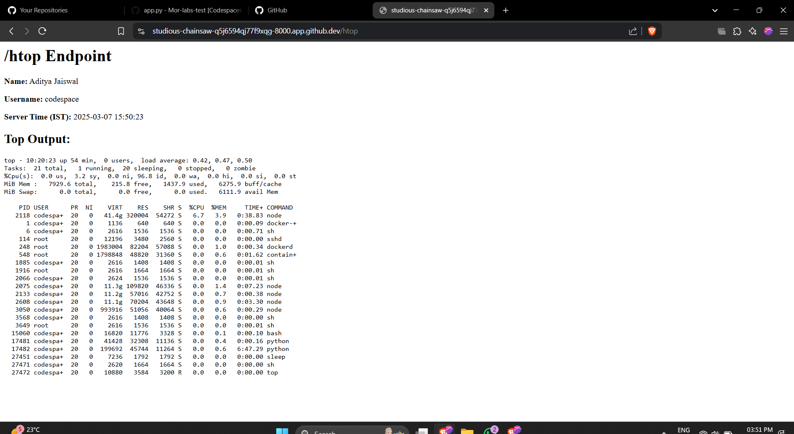

# Mor-labs-test
---

# Flask `/htop` Endpoint Application

This is a simple **Flask application** running on **GitHub Codespaces** that provides system information via the `/htop` endpoint.

---

## 📌 `/htop` Endpoint

When you visit the `/htop` endpoint, it displays:
- **Name** – Full name.
- **Username** – System username.
- **Server Time** – Current server time in **IST**.
- **Top Output** – Live system resource usage using the `top` command.

---

## 🚀 How to Run

1. **Start your GitHub Codespace.**
2. Make sure Flask is installed:
   ```bash
   pip install flask pytz
   ```
3. Run the app:
   ```bash
   python app.py
   ```
4. Expose **port 8000** with **Public** visibility in Codespaces.
5. Access the `/htop` endpoint via:
   ```
   https://<your-codespace-name>-8000.app.github.dev/htop
   ```

---

## ✅ Example Screenshot

> Running application :



---

## 📝 Author
**Aditya Jaiswal**  
GitHub: [Aditya-jaiswal07972](https://github.com/Aditya-jaiswal07972)

---

## 🌐 Live Demo

- **App URL:** [https://studious-chainsaw-q5j6594qj77f9xqg-8000.app.github.dev/htop](https://studious-chainsaw-q5j6594qj77f9xqg-8000.app.github.dev/htop)
- **Repository:** [https://github.com/Aditya-jaiswal07972/Mor-labs-test](https://github.com/Aditya-jaiswal07972/Mor-labs-test)

---
